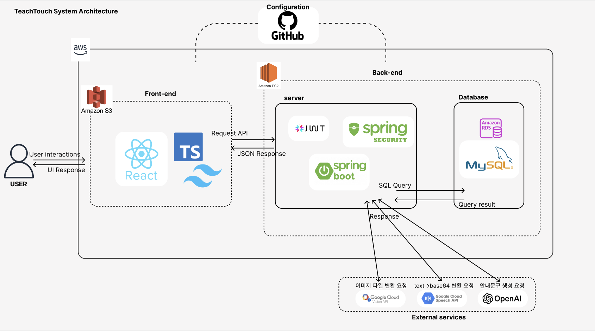
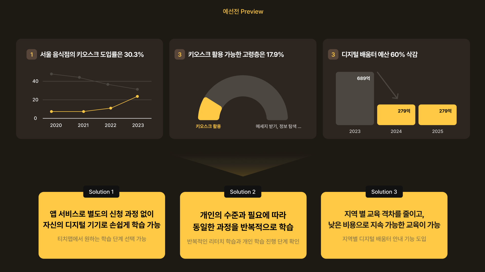
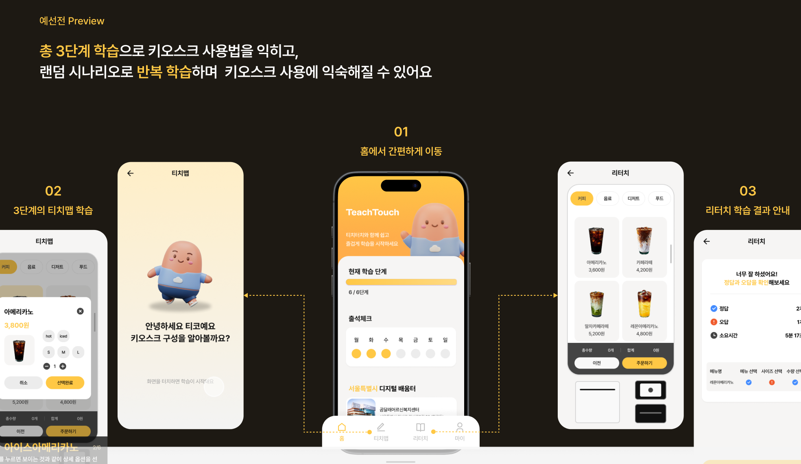
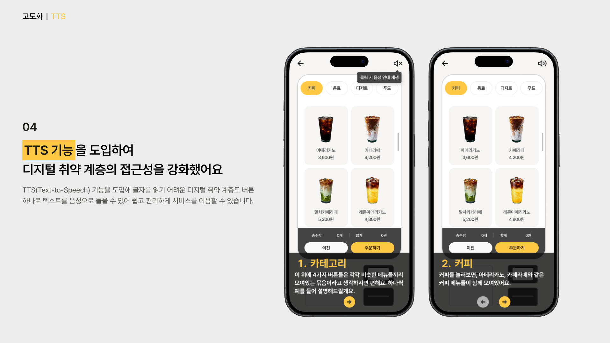
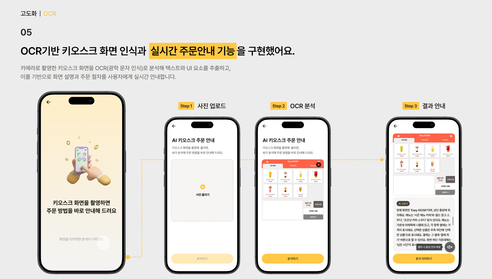

# TeachTouch

세대를 연결하고 배우고 가르치는 시간, **티치터치(TeachTouch)**

TeachTouch는 키오스크 사용에 어려움을 겪는 **디지털 약자(고령층, 초보자 등)**를 위한 모바일 학습 플랫폼입니다.  
TTS와 OCR 기술을 접목하여 실제와 유사한 환경 속에서 **반복적인 자기주도 학습**을 가능하게 합니다.

---

## 📸 아키텍처 개요

> OCR + TTS 기반의 모바일 키오스크 학습 앱 구조

---

## ✅ 프로젝트 배경

- **서울 음식점 키오스크 도입률**은 30.3%
- **실제 활용 가능한 고령층은 17.9%**로 매우 낮음
- **디지털 배움터 예산이 60% 삭감(689억 → 279억)**되어  
  지속적인 오프라인 교육 지원이 어려운 상황입니다.

이러한 문제를 TeachTouch가 해결합니다.

---

## 🧩 핵심 기능

### 1. 앱 기반 자기주도 학습

- 별도 신청 없이 본인의 디지털 기기에서 사용 가능
- 티치맵을 통해 **학습 단계 선택 및 진도 체크**
- 출석체크 기능 포함

### 2. 3단계 키오스크 시나리오 학습

1. **홈에서 학습 시작**
2. **단계별 실전 시뮬레이션** (카페 키오스크 기반)
3. **리터치 결과 리포트** 제공 (정오답, 소요 시간 등)

### 3. TTS (Text-to-Speech) 기능

- 화면 버튼 클릭 시 **음성 안내 자동 재생**
- 텍스트 읽기 어려운 사용자에게 정보 전달 강화

### 4. OCR 기반 실시간 안내

- **카메라로 키오스크 촬영 → 텍스트·UI 분석**
- 사용자가 보고 있는 화면을 이해하고 **주문 방식 안내**

---

## 🎯 기대 효과

| 문제 | TeachTouch 솔루션 |
|------|-------------------|
| 고령층 키오스크 활용 낮음 | 실전 기반 반복 학습 |
| 예산 삭감으로 교육 지속 불가 | 모바일 기반 교육으로 전환 |
| 지역/세대 간 교육 격차 | 비대면 학습으로 격차 해소 |
| 동일 설명 반복 어려움 | AI 시나리오 학습으로 자동화 |

---

## 📍 서비스 예시 화면
### 예선전 Preview

### 3단계 티치맵 학습

### TTS 기능 예시

### OCR 안내 흐름

---

## 🛠 기술 스택

- **프론트엔드**: React + ts + tailwind
- **백엔드**: Spring Boot (Java 기반)
- **OCR 분석**: Google Cloud Vision API
- **TTS**: Google Text-to-Speech
- **서버 호스팅**: AWS EC2 + RDS

---

## 🔮 향후 개발 방향

- 다양한 키오스크 UI 학습 확장 (패스트푸드, 영화관 등)
- 시니어 맞춤 인터페이스 개선
- 점자 / 청각 보조 기능 탑재
- 지역 디지털 배움터와 연계한 학습 연동 기능

---

## 📂 디렉토리 구조 
src/main/java/com/teachtouch/backend/
├── attendance
│   ├── controller
│   ├── dto
│   ├── entity
│   ├── repository
│   └── service
├── auth
│   ├── dto
│   ├── entity
│   └── repository
├── example
│   ├── controller
│   ├── dto
│   ├── entity
│   ├── repository
│   └── service
├── global
│   ├── config
│   ├── entity
│   ├── exception
│   ├── jwt
│   └── security
├── guide
│   ├── controller
│   ├── converter
│   ├── dto
│   ├── entity
│   ├── repository
│   └── service
├── ocr
│   ├── controller
│   ├── handler
│   └── serivce
├── product
│   ├── controller
│   ├── dto
│   ├── entity
│   ├── repository
│   └── service
├── retouch
│   ├── controller
│   ├── dto
│   ├── entity
│   ├── exception
│   ├── repository
│   └── service
├── tts
│   ├── controller
│   ├── dto
│   └── service
└── user
├── controller
├── dto
├── entity
├── repository
└── service
